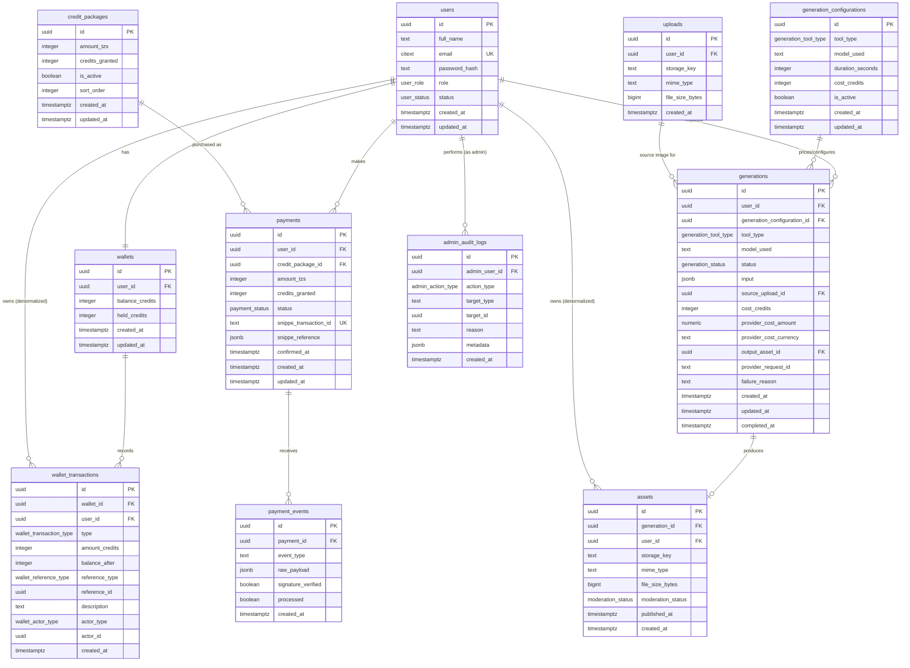

# SanaaAI — DATABASE.md

Status: Implementation-ready draft. Grounded in `PRD.md` (business rules, entities named in §22) and `ARCHITECTURE.md` (PostgreSQL, hold/settle/release wallet pattern, append-only ledger) and consistent with the type names already defined in `CONVENTIONS.md`. Where a decision is not yet locked, it is marked **TBD** rather than invented — do not resolve a TBD silently during implementation.

---

## 1. Overview

**DBMS: PostgreSQL** (locked in `ARCHITECTURE.md` — chosen for ACID transaction guarantees, required for a credit ledger where double-crediting or double-debiting is unacceptable).

Design priorities, in order:
1. **Financial integrity** — the wallet, ledger, and payment tables are the most important tables in this system. Every other table is secondary to getting these right.
2. **Auditability** — every credit movement must be traceable to a cause (a payment, a generation, an admin action).
3. **Simplicity** — this is an MVP for three creation tools, not a general-purpose platform. Do not add tables or columns for features excluded in `PRD.md` §6.3.

Naming conventions (per `CONVENTIONS.md` §4): tables snake_case plural, columns snake_case. All primary keys are UUIDs (`uuid`, generated via `gen_random_uuid()` — requires the `pgcrypto` extension, or the native `gen_random_uuid()` available in PostgreSQL 13+). All monetary/credit amounts are integers — never floating point (per `CONVENTIONS.md` §3.8).

---

## 2. Tables

### 2.1 `users`

Purpose: account records for authenticated users.

| Column | Type | Nullable | Default | Notes |
|---|---|---|---|---|
| `id` | `uuid` | No | `gen_random_uuid()` | Primary key |
| `full_name` | `text` | No | — | Per PRD §8 registration fields |
| `email` | `citext` | No | — | Case-insensitive; unique |
| `password_hash` | `text` | No | — | Never store plaintext; hashing algorithm TBD in `SECURITY.md` |
| `role` | `user_role` (enum) | No | `'user'` | See §5 |
| `status` | `user_status` (enum) | No | `'active'` | See §5 |
| `created_at` | `timestamptz` | No | `now()` | |
| `updated_at` | `timestamptz` | No | `now()` | Updated via trigger on row change |

Constraints:
- `UNIQUE (email)`
- `CHECK (char_length(full_name) > 0)`

Indexes:
- Unique index on `email` (created automatically by the unique constraint).

**TBD:** additional registration fields (PRD §8.1), password policy enforcement fields (e.g. `password_updated_at`) pending `SECURITY.md`.

---

### 2.2 `wallets`

Purpose: one prepaid credit wallet per user. Holds a **cached** balance for fast reads — the ledger (`wallet_transactions`) is the source of truth; this column exists for read performance only and must only ever be updated in the same DB transaction as a new `wallet_transactions` row (per `CONVENTIONS.md` §3.1).

| Column | Type | Nullable | Default | Notes |
|---|---|---|---|---|
| `id` | `uuid` | No | `gen_random_uuid()` | Primary key |
| `user_id` | `uuid` | No | — | FK → `users.id`, unique (one wallet per user) |
| `balance_credits` | `integer` | No | `0` | Cached running total; never written to directly outside a ledger-insert transaction |
| `held_credits` | `integer` | No | `0` | Sum of currently-outstanding holds (see §2.3); `balance_credits` excludes held amounts already reserved |
| `created_at` | `timestamptz` | No | `now()` | |
| `updated_at` | `timestamptz` | No | `now()` | |

Constraints:
- `UNIQUE (user_id)`
- `CHECK (balance_credits >= 0)`
- `CHECK (held_credits >= 0)`

Foreign keys:
- `user_id` → `users.id`, `ON DELETE RESTRICT` (a user with a wallet history must not be hard-deleted — see §9 on deletes).

Indexes:
- Unique index on `user_id`.

---

### 2.3 `wallet_transactions`

Purpose: the append-only credit ledger. This is the single most important table in the schema — the authoritative record of every credit movement. Referred to as `CreditLedgerEntry` in `PRD.md` §22; table and TypeScript type named `wallet_transactions` / `WalletTransaction` per `CONVENTIONS.md` — same entity, one name used consistently in implementation.

| Column | Type | Nullable | Default | Notes |
|---|---|---|---|---|
| `id` | `uuid` | No | `gen_random_uuid()` | Primary key |
| `wallet_id` | `uuid` | No | — | FK → `wallets.id` |
| `user_id` | `uuid` | No | — | FK → `users.id`; denormalized for query convenience, must always match `wallets.user_id` for the referenced wallet |
| `type` | `wallet_transaction_type` (enum) | No | — | See §5 |
| `amount_credits` | `integer` | No | — | Signed: positive = credit added, negative = credit removed. Never zero (`CHECK (amount_credits != 0)`) |
| `balance_after` | `integer` | No | — | Snapshot of `wallets.balance_credits` immediately after this transaction was applied — the auditable record, independent of the cached wallet balance |
| `reference_type` | `wallet_reference_type` (enum) | No | — | What this transaction relates to: `'payment'`, `'generation'`, `'admin_adjustment'` |
| `reference_id` | `uuid` | No | — | ID of the related `payments`, `generations`, or admin action row (no FK constraint — polymorphic reference; enforce validity in application logic) |
| `description` | `text` | No | — | Human-readable reference, per PRD §13 |
| `actor_type` | `wallet_actor_type` (enum) | No | — | `'user'`, `'system'`, `'admin'` |
| `actor_id` | `uuid` | Yes | `NULL` | User or admin ID if `actor_type` is `'user'` or `'admin'`; `NULL` if `'system'` |
| `created_at` | `timestamptz` | No | `now()` | Immutable — this table has no `updated_at`; rows are never modified after insert |

Constraints:
- `CHECK (amount_credits != 0)`
- **No `UPDATE` or `DELETE` should ever be issued against this table** by application code — enforce at the application layer (repository pattern with insert-only methods) since PostgreSQL itself doesn't have a native "append-only" table constraint. A `REVOKE UPDATE, DELETE` on this table for the application's DB role is a defensible additional safeguard — flag for `SECURITY.md`.

Foreign keys:
- `wallet_id` → `wallets.id`, `ON DELETE RESTRICT`
- `user_id` → `users.id`, `ON DELETE RESTRICT`

Indexes:
- `(wallet_id, created_at)` — for fetching a wallet's transaction history in order.
- `(user_id, created_at)` — for a user's full transaction history view.
- `(reference_type, reference_id)` — for finding all ledger entries tied to a specific payment or generation (needed to reconcile holds/settles/releases for one generation).

---

### 2.4 `credit_packages`

Purpose: configurable top-up packages (PRD §12.1). Stored as data, not hard-coded, per PRD's explicit instruction that pricing is a business rule.

| Column | Type | Nullable | Default | Notes |
|---|---|---|---|---|
| `id` | `uuid` | No | `gen_random_uuid()` | Primary key |
| `amount_tzs` | `integer` | No | — | Price in TZS |
| `credits_granted` | `integer` | No | — | Credits awarded for this package |
| `is_active` | `boolean` | No | `true` | Inactive packages are hidden from new purchases but preserved for historical `payments` rows referencing them |
| `sort_order` | `integer` | No | `0` | Display order |
| `created_at` | `timestamptz` | No | `now()` | |
| `updated_at` | `timestamptz` | No | `now()` | |

Constraints:
- `CHECK (amount_tzs > 0)`
- `CHECK (credits_granted > 0)`

**Note:** disabling a package (per PRD §24's rule on not destroying historical records) sets `is_active = false`; it is never hard-deleted if any `payments` row references it.

---

### 2.5 `payments`

Purpose: one row per top-up attempt via Snippe. Referred to as `Payment` in PRD §22.

| Column | Type | Nullable | Default | Notes |
|---|---|---|---|---|
| `id` | `uuid` | No | `gen_random_uuid()` | Primary key |
| `user_id` | `uuid` | No | — | FK → `users.id` |
| `credit_package_id` | `uuid` | Yes | `NULL` | FK → `credit_packages.id`; nullable in case of a custom/admin-initiated top-up not tied to a package |
| `amount_tzs` | `integer` | No | — | Authoritative amount charged, copied from the package at time of purchase (never re-read live from `credit_packages` after the fact, so historical payments remain accurate if package pricing changes later) |
| `credits_granted` | `integer` | No | — | Same reasoning — snapshotted at purchase time |
| `status` | `payment_status` (enum) | No | `'pending'` | See §5 |
| `snippe_transaction_id` | `text` | Yes | `NULL` | Snippe's reference ID; set once Snippe responds; **unique** — this is the idempotency key required by PRD §14.1 |
| `snippe_reference` | `jsonb` | Yes | `NULL` | Raw provider metadata for support/debugging — never store secrets here |
| `confirmed_at` | `timestamptz` | Yes | `NULL` | Set when status transitions to `'confirmed'` |
| `created_at` | `timestamptz` | No | `now()` | |
| `updated_at` | `timestamptz` | No | `now()` | |

Constraints:
- `UNIQUE (snippe_transaction_id)` — enforces webhook idempotency at the DB level, per PRD §14.1 rule 4. (Nullable-unique: multiple `NULL`s are permitted by Postgres, which is correct — a `pending` payment awaiting its first Snippe response has no ID yet.)
- `CHECK (amount_tzs > 0)`
- `CHECK (credits_granted > 0)`

Foreign keys:
- `user_id` → `users.id`, `ON DELETE RESTRICT`
- `credit_package_id` → `credit_packages.id`, `ON DELETE SET NULL`

Indexes:
- `(user_id, created_at)` — user's payment history.
- `(status)` — for the reconciliation job to efficiently find stuck `pending` payments (PRD §14).

---

### 2.6 `payment_events`

Purpose: raw log of every webhook/event received from Snippe for a payment — an audit trail distinct from the `payments` row's current state, so a disputed charge can be reconstructed. Referred to as `PaymentEvent` in PRD §22.

| Column | Type | Nullable | Default | Notes |
|---|---|---|---|---|
| `id` | `uuid` | No | `gen_random_uuid()` | Primary key |
| `payment_id` | `uuid` | No | — | FK → `payments.id` |
| `event_type` | `text` | No | — | Raw event/status name as received from Snippe |
| `raw_payload` | `jsonb` | No | — | Full webhook payload, minus any secret/signature material |
| `signature_verified` | `boolean` | No | — | Whether this event passed signature verification (PRD §14.1 rule 3) |
| `processed` | `boolean` | No | `false` | Whether this event resulted in a state change to `payments` |
| `created_at` | `timestamptz` | No | `now()` | |

Constraints:
- None beyond FK and not-null.

Foreign keys:
- `payment_id` → `payments.id`, `ON DELETE CASCADE` (event log is meaningless without its parent payment).

Indexes:
- `(payment_id, created_at)`.

**Note:** an event with `signature_verified = false` must never be allowed to affect `payments.status` or credit a wallet — enforce in application logic; this table exists partly to make that enforcement auditable after the fact.

---

### 2.7 `generations`

Purpose: one row per generation request across all three MVP tools. Polymorphic by `tool_type`. Referred to as `Generation` in PRD §22 and `CONVENTIONS.md`.

| Column | Type | Nullable | Default | Notes |
|---|---|---|---|---|
| `id` | `uuid` | No | `gen_random_uuid()` | Primary key |
| `user_id` | `uuid` | No | — | FK → `users.id` |
| `generation_configuration_id` | `uuid` | No | — | FK → `generation_configurations.id` — the config active at submission time (see §2.10) |
| `tool_type` | `generation_tool_type` (enum) | No | — | See §5 |
| `model_used` | `text` | No | — | e.g. `'soul-2'`, `'kling-2.5-turbo-standard'` — internal only, never shown to the user per PRD §5 |
| `status` | `generation_status` (enum) | No | `'pending'` | See §5 |
| `input` | `jsonb` | No | — | Prompt, duration, aspect ratio, etc. — shape matches `GenerationInput` in `CONVENTIONS.md` §2. Does **not** carry the source image reference — see `source_upload_id` below |
| `source_upload_id` | `uuid` | Yes | `NULL` | FK → `uploads.id` — set only for `image_to_video`; `NULL` for `ai_image`/`text_to_video` |
| `cost_credits` | `integer` | No | — | Authoritative cost at time of submission, snapshotted from `generation_configurations.cost_credits` — never re-read live, so history is preserved if pricing later changes (PRD §24) |
| `provider_cost_amount` | `numeric(14,6)` | Yes | `NULL` | Actual Higgsfield cost for this generation, in `provider_cost_currency` — feeds PRD §3.1 margin metrics; nullable since it may only be known after the provider responds |
| `provider_cost_currency` | `text` | Yes | `NULL` | e.g. `'USD'` — Higgsfield bills in USD per earlier pricing research |
| `output_asset_id` | `uuid` | Yes | `NULL` | FK → `assets.id`; set on successful completion |
| `provider_request_id` | `text` | Yes | `NULL` | Higgsfield's request/job ID, for support/reconciliation |
| `failure_reason` | `text` | Yes | `NULL` | Set on `failed`; internal detail, not necessarily shown verbatim to the user |
| `created_at` | `timestamptz` | No | `now()` | |
| `updated_at` | `timestamptz` | No | `now()` | |
| `completed_at` | `timestamptz` | Yes | `NULL` | Set when status reaches a terminal state |

Constraints:
- `CHECK (cost_credits > 0)`
- `CHECK (provider_cost_amount IS NULL OR provider_cost_amount >= 0)`

Foreign keys:
- `user_id` → `users.id`, `ON DELETE RESTRICT`
- `generation_configuration_id` → `generation_configurations.id`, `ON DELETE RESTRICT`
- `source_upload_id` → `uploads.id`, `ON DELETE RESTRICT`
- `output_asset_id` → `assets.id`, `ON DELETE SET NULL`

Indexes:
- `(user_id, created_at)` — generation history view (PRD §16), must support efficient "my generations, newest first" queries.
- `(status)` — for background reconciliation jobs finding stuck generations.
- `(provider_request_id)` — for looking up a generation by Higgsfield's reference during support/debugging.
- `(generation_configuration_id)` — for reporting/margin queries grouped by tool config.

---

### 2.10 `generation_configurations`

Purpose: server-controlled, currently-active pricing and provider-mapping for each generation tool. `generations` rows snapshot their `cost_credits` and `model_used` at submission time (they never re-read this table live), so changing a configuration's price here never retroactively alters a past charge — satisfying PRD §24's rule that pricing changes never silently propagate.

| Column | Type | Nullable | Default | Notes |
|---|---|---|---|---|
| `id` | `uuid` | No | `gen_random_uuid()` | Primary key |
| `tool_type` | `generation_tool_type` (enum) | No | — | See §5 |
| `model_used` | `text` | No | — | Current Higgsfield model mapping for this tool (e.g. `'kling-2.5-turbo-standard'`) |
| `duration_seconds` | `integer` | Yes | `NULL` | For video tools; `NULL` for `'ai_image'` |
| `cost_credits` | `integer` | No | — | Current credit price for this exact tool/duration combination — matches PRD §12.2's locked table |
| `is_active` | `boolean` | No | `true` | Inactive configurations are hidden from new generation requests but preserved for `generations` rows referencing them |
| `created_at` | `timestamptz` | No | `now()` | |
| `updated_at` | `timestamptz` | No | `now()` | |

Constraints:
- `CHECK (cost_credits > 0)`
- `UNIQUE (tool_type, duration_seconds)` where `is_active = true` — enforced via a partial unique index, so only one active configuration exists per tool/duration combination at a time: `CREATE UNIQUE INDEX ... ON generation_configurations (tool_type, duration_seconds) WHERE is_active;`

Indexes:
- `(tool_type, is_active)` — for looking up the current active configuration when a user submits a generation request.

**Note:** this table replaces what an earlier draft of this schema modeled as inline JSONB on `generations` alone. Splitting current-config from historical-charge (via the `generation_configuration_id` FK + `cost_credits` snapshot on `generations`) is a cleaner, more auditable realization of PRD §24's "provider price changes never silently change customer pricing" rule than embedding pricing logic only in application code.

---

### 2.11 `uploads`

Purpose: raw user-uploaded source material — currently, only the source image for `image_to_video` (PRD §10.3). Deliberately kept separate from `assets` (§2.8): `assets` represents *generated output* (has moderation/publishing state, can appear in Explore); an upload is raw input material with neither concept applying to it. Conflating the two into one nullable-FK table would force every asset-related query to first branch on "is this actually output," which is unnecessary complexity for what are two genuinely different things.

| Column | Type | Nullable | Default | Notes |
|---|---|---|---|---|
| `id` | `uuid` | No | `gen_random_uuid()` | Primary key |
| `user_id` | `uuid` | No | — | FK → `users.id` |
| `storage_key` | `text` | No | — | Path/key in object storage (same provider as `assets` — PRD §19.10 TBD) |
| `mime_type` | `text` | No | — | Validated at upload time; allowed types TBD (PRD §19.12) |
| `file_size_bytes` | `bigint` | Yes | `NULL` | For future upload-limit enforcement (PRD §19.12) |
| `created_at` | `timestamptz` | No | `now()` | |

Constraints: none beyond FK/not-null.

Foreign keys:
- `user_id` → `users.id`, `ON DELETE RESTRICT`

Indexes:
- `(user_id, created_at)` — for any future "your uploads" view and for ownership checks when a generation references one.

**Retention note:** an upload with no `generations` row referencing it (user uploaded an image, then abandoned the flow) is a candidate for cleanup, but per §11's rule, no automated deletion job should exist until a retention policy is explicitly decided — this applies to `uploads` exactly as it does to `assets`.

---

### 2.8 `assets`

Purpose: application-controlled storage record for a completed generation's output file (PRD §15). Referred to as `Asset` in PRD §22 and `CONVENTIONS.md`.

| Column | Type | Nullable | Default | Notes |
|---|---|---|---|---|
| `id` | `uuid` | No | `gen_random_uuid()` | Primary key |
| `generation_id` | `uuid` | No | — | FK → `generations.id` |
| `user_id` | `uuid` | No | — | FK → `users.id`; denormalized for fast ownership checks (PRD §16 access-control rule) |
| `storage_key` | `text` | No | — | Path/key in object storage (provider TBD — PRD §19.10) |
| `mime_type` | `text` | No | — | Validated at upload/generation time per PRD §20 |
| `file_size_bytes` | `bigint` | Yes | `NULL` | For quota/limit enforcement once upload limits (PRD §19.12) are decided |
| `moderation_status` | `moderation_status` (enum) | No | `'private'` | See §5. Ships from day one per PRD §7's explicit instruction to avoid a schema retrofit |
| `published_at` | `timestamptz` | Yes | `NULL` | Set when a user explicitly publishes to Explore |
| `created_at` | `timestamptz` | No | `now()` | |

Constraints:
- None beyond FK/not-null.

Foreign keys:
- `generation_id` → `generations.id`, `ON DELETE RESTRICT` (an asset must not outlive the record of what generated it)
- `user_id` → `users.id`, `ON DELETE RESTRICT`

Indexes:
- `(generation_id)` — unique, one asset per generation for MVP (one output per request).
- `(user_id)` — ownership queries.
- `(moderation_status, published_at)` — for the Explore page query ("published items, newest first").

---

### 2.9 `admin_audit_logs`

Purpose: record of every admin action with material effect (manual credit adjustments, Explore content removal). Referred to as `AdminAuditLog` in PRD §22.

| Column | Type | Nullable | Default | Notes |
|---|---|---|---|---|
| `id` | `uuid` | No | `gen_random_uuid()` | Primary key |
| `admin_user_id` | `uuid` | No | — | FK → `users.id`, must have `role = 'admin'` at time of action (enforced in application logic, not a DB constraint) |
| `action_type` | `admin_action_type` (enum) | No | — | See §5 |
| `target_type` | `text` | No | — | e.g. `'user'`, `'generation'`, `'asset'`, `'wallet'` |
| `target_id` | `uuid` | No | — | ID of the affected row (polymorphic — no FK constraint) |
| `reason` | `text` | No | — | Mandatory per PRD §17 — a manual credit adjustment or content removal without a reason must be rejected at the application layer |
| `metadata` | `jsonb` | Yes | `NULL` | Additional context (e.g. old/new values) |
| `created_at` | `timestamptz` | No | `now()` | |

Constraints:
- `CHECK (char_length(reason) > 0)`

Foreign keys:
- `admin_user_id` → `users.id`, `ON DELETE RESTRICT`

Indexes:
- `(admin_user_id, created_at)`
- `(target_type, target_id)` — for viewing all admin actions against a specific record.

---

## 3. Relationships & Cardinality

| Relationship | Cardinality |
|---|---|
| `users` → `wallets` | 1 : 1 |
| `wallets` → `wallet_transactions` | 1 : many |
| `users` → `wallet_transactions` | 1 : many (denormalized) |
| `credit_packages` → `payments` | 1 : many |
| `users` → `payments` | 1 : many |
| `payments` → `payment_events` | 1 : many |
| `users` → `generations` | 1 : many |
| `generation_configurations` → `generations` | 1 : many |
| `uploads` → `generations` | 1 : many (nullable, `image_to_video` only) |
| `generations` → `assets` | 1 : 1 (MVP — one output per generation) |
| `users` → `assets` | 1 : many (denormalized) |
| `users` → `admin_audit_logs` | 1 : many (as the acting admin) |

---

## 4. ERD (Mermaid)



---

## 5. Enums

```sql
CREATE TYPE user_role AS ENUM ('user', 'admin');

CREATE TYPE user_status AS ENUM ('active', 'suspended');
-- 'suspended' provisioned for admin capability (PRD §17) even though
-- suspension flow specifics are not detailed in PRD — usage is TBD.

CREATE TYPE wallet_transaction_type AS ENUM (
  'hold',      -- credits reserved when a generation starts
  'settle',    -- hold finalized into a real deduction on generation success
  'release',   -- hold cancelled/returned on generation failure
  'topup',     -- credits added from a confirmed payment
  'refund',    -- admin-issued or policy-driven refund outside the hold/settle/release flow
  'admin_adjustment' -- manual admin credit change, always paired with an admin_audit_logs row
);

CREATE TYPE wallet_reference_type AS ENUM ('payment', 'generation', 'admin_adjustment');

CREATE TYPE wallet_actor_type AS ENUM ('user', 'system', 'admin');

CREATE TYPE payment_status AS ENUM ('pending', 'confirmed', 'failed');

CREATE TYPE generation_tool_type AS ENUM ('ai_image', 'text_to_video', 'image_to_video');
-- 'product_ad' intentionally excluded — tool is deferred to v1.1 per PRD §6.2.
-- Add it to this enum only when the tool actually ships, via a migration.

CREATE TYPE generation_status AS ENUM (
  'pending',
  'submitted',
  'processing',
  'completed',
  'failed',
  'needs_reconciliation' -- per PRD §13.1 rule 9 — ambiguous provider timeout, not user-facing verbatim
);

CREATE TYPE moderation_status AS ENUM ('private', 'pending_review', 'published', 'rejected');

CREATE TYPE admin_action_type AS ENUM (
  'credit_adjustment',
  'content_hide',
  'content_remove',
  'user_suspend',
  'user_reactivate'
);
```

**TBD:** whether `generation_status` needs a `cancelled` state — PRD does not describe a user-initiated cancellation flow for MVP; not added here since PRD §10 describes no such feature. Flag for approval if cancellation is added later — do not add speculatively.

---

## 6. Data Integrity & Security Considerations

1. **The hold/settle/release pattern is enforced at the application layer, not purely by schema.** The schema (via `wallet_transactions` + `wallets.held_credits`) supports it, but PostgreSQL cannot itself guarantee a `hold` is always followed by exactly one `settle` or `release` — this must be covered by the test requirements already stated in `CONVENTIONS.md` §6.
2. **Concurrency:** any operation that reads `wallets.balance_credits`/`held_credits` and then writes based on it (placing a hold, confirming a payment) must use a row-level lock (`SELECT ... FOR UPDATE` on the wallet row) inside the transaction, to prevent two concurrent requests from both passing a balance check before either commits — this is what prevents the "concurrent overspending" failure PRD/architecture both warn about.
3. **`wallet_transactions` is append-only by application convention.** Consider revoking `UPDATE`/`DELETE` grants on this table for the application's runtime DB role as a defense-in-depth measure (flagged for `SECURITY.md`, not decided here).
4. **Idempotency:** `payments.snippe_transaction_id` unique constraint is the actual enforcement mechanism for PRD §14.1 rule 4 — a webhook handler should attempt to record this ID and treat a unique-constraint violation as "already processed, no-op," not as an application error.
5. **Ownership enforcement:** every query for a `generations` or `assets` row on behalf of a user must filter by `user_id` at the query level — the `(user_id)` indexes above exist specifically to make this cheap, not just for listing pages. Never rely on obscurity of a UUID alone (PRD §16's access-control rule).
6. **No secrets in the database.** `payments.snippe_reference` and `payment_events.raw_payload` are for debugging/support and must never contain Snippe API secrets or full mobile money account numbers — sanitize before storage.
7. **Soft deletes:** no table in this schema uses a soft-delete flag for MVP. `users`, `generations`, `payments`, and `wallet_transactions` are financial/audit records and are never deleted, only status-transitioned (`user_status = 'suspended'`, `generation_status = 'failed'`, etc.) — `ON DELETE RESTRICT` on the relevant foreign keys enforces this at the DB level by making hard deletion of a referenced `users` row fail loudly rather than cascade silently. `credit_packages.is_active` serves the same purpose for pricing data (§2.4). If a genuine user-data-deletion requirement emerges (e.g. GDPR-style request), that needs a dedicated decision — **TBD**, not addressed by this MVP schema.

---

## 7. Migration & Seeding Requirements

### 7.1 Migrations
- Use a migration tool matching the chosen backend framework (NestJS → TypeORM/Prisma migrations, per `ARCHITECTURE.md`'s stack choice — exact tool: **TBD**, to be fixed when `ARCHITECTURE.md`'s stack is implemented).
- Per `CONVENTIONS.md` §3.7: any migration touching `wallet_transactions`, `payments`, or `generations` must be additive (new nullable columns/new tables) — never a destructive change (dropping/renaming a column, tightening a constraint on existing data) without explicit human sign-off, since these are financial/audit-critical tables.
- Enum changes (e.g. adding `'product_ad'` to `generation_tool_type` when that tool ships) use `ALTER TYPE ... ADD VALUE`, which is additive and safe.

### 7.2 Seeding
Required seed data for a working local/dev environment:
- At least one `admin`-role user for testing admin functionality. Admin bootstrap method for production (how the first admin account is created safely, without a committed default password): **TBD**.
- The initial `credit_packages` rows matching PRD §12.1's working assumption (2,000/20, 5,000/50, 10,000/100, 20,000/200, 50,000/500) — seeded as data, consistent with the PRD's instruction that pricing must never be hard-coded in application logic.
- The initial `generation_configurations` rows matching PRD §12.2's locked pricing (AI Image 2 credits; video 15 credits/5s, 30 credits/10s; both video tools on `kling-2.5-turbo-standard`). **Do not seed unverified Higgsfield model/endpoint identifiers as active production configuration** — verify against the live provider first (PRD §11); seed as `is_active = false` in non-production environments if not yet verified.
- No seed data for `generations`, `payments`, or `wallet_transactions` — these should only ever be created through the real application flow, even in development, so the hold/settle/release and payment-confirmation logic is actually exercised during testing.
- Seeds must be idempotent (safe to re-run) — use stable identifiers or upserts, not blind inserts.

---

## 9. Testing Requirements for Database Logic

Automated tests must cover, at minimum:

**Wallet**
- A wallet is created for every new user.
- `balance_credits` can never go negative (constraint + application logic both).
- Concurrent hold/debit attempts against the same wallet cannot together overspend the balance (requires the row-lock behavior in §6.2).
- `wallet_transactions.balance_after` always matches the wallet's actual resulting balance.

**Payments**
- A confirmed payment credits the wallet exactly once.
- A duplicate webhook delivery for the same `snippe_transaction_id` does not duplicate credits.
- A `pending` or `failed` payment never credits the wallet.

**Generations**
- Insufficient balance prevents a hold from being placed.
- A successful generation debits (settles) exactly once.
- A technical failure releases the hold exactly once.
- A generation's `cost_credits` reflects the price at submission time even if the related `generation_configurations` row is later changed.
- Voluntary regeneration always creates a new `generations` row with its own charge — never reuses or discounts a prior one.
- A generation defaults to private; an incomplete (non-`completed`) generation can never be published to Explore.

**Authorization / ownership**
- A user cannot read another user's `generations`, `assets`, or `payments` rows through any repository/query path, even with a guessed or enumerated ID.
- Every `admin_audit_logs`-worthy admin action actually produces a logged row with a non-empty reason.

**Constraints**
- Tests should deliberately attempt invalid values (negative balances, empty admin reasons, duplicate `snippe_transaction_id`) to confirm the database constraints are actually enforced, not just assumed.

---

## 10. Backup & Recovery

Production PostgreSQL must have automated backups. Exact provider and retention period: **TBD**. At minimum, before launch:
- Automated backups running on a schedule.
- A documented restore procedure.
- The restore procedure actually tested at least once, not just documented.
- Backups stored with no public access.
- Backup access credentials kept separate from the application's normal runtime database credentials where the hosting provider allows it.

Object storage (for `assets`) backup/versioning policy depends on the storage provider decision (PRD §19.10) and is not addressed here.

---

## 11. Data Retention

The following retention decisions are **TBD** and must not be silently resolved during implementation:
- User account deletion/anonymization policy.
- Generated and uploaded asset retention period.
- `payment_events.raw_payload` retention period.
- `admin_audit_logs` retention period.
- Database backup retention period.

**Until these are explicitly decided, implementation must not add automated destructive cleanup of any financial or audit table** (`wallet_transactions`, `payments`, `payment_events`, `generations`, `admin_audit_logs`). A cleanup job for non-critical data (e.g. expired temporary provider URLs that were never persisted as `assets`) is fine; deleting rows from the tables above is not, absent an explicit policy.

---

## 12. Database Guardrails (for developers and AI coding agents)

1. This file is the primary physical-schema reference; `PRD.md` remains the product source of truth and `ARCHITECTURE.md` the system source of truth — if any of the three appear to conflict, stop and flag it rather than guessing which wins.
2. Do not add tables for features excluded in PRD §6.3 (followers, likes, comments, messaging, marketplace, subscriptions) "because they're common in SaaS."
3. Never store generated images/video as database blobs — object storage only, per §1.
4. Never modify `wallets.balance_credits` without a corresponding `wallet_transactions` insert in the same transaction.
5. Never `UPDATE` or `DELETE` a `wallet_transactions` row.
6. Never credit the same `payments` row's wallet top-up more than once — enforced by the `snippe_transaction_id` unique constraint plus idempotent webhook handling.
7. Never debit or refund the same generation more than once — one `hold`, followed by exactly one `settle` or `release`, per generation.
8. Use a row-level lock (`SELECT ... FOR UPDATE`) inside a DB transaction for any operation that checks a wallet balance and then acts on it.
9. Never expose another user's private data based solely on a guessable/sequential-looking ID — enforced here by UUID primary keys plus mandatory ownership filtering in every query.
10. Never seed unverified provider model identifiers as active production configuration (§7.2).
11. Mark unresolved product or technical decisions as TBD rather than guessing — this file's existing TBD markers (§8, §11) are the canonical list; do not silently resolve one during implementation.

---

## 13. Database Definition of Done

The MVP database implementation is complete when:
- All tables in §2 exist via migrations, with foreign keys and check constraints active.
- Case-insensitive email uniqueness is enforced on `users`.
- Every user has exactly one wallet, and wallet balance can never go negative.
- Credit packages and generation configurations are stored as data, not hard-coded.
- A confirmed payment can credit a wallet only once; a completed generation can be debited only once and refunded/released only once.
- Generation history preserves the exact configuration and credit cost that applied at the time, independent of later configuration changes.
- Public Explore content is private by default and limited to `completed` generations with `moderation_status = 'published'`.
- Every sensitive admin action produces an `admin_audit_logs` row with a reason.
- The indexes in §2 support the wallet, payment, generation-history, and Explore access patterns without full table scans at expected MVP scale.
- The concurrency and idempotency tests in §9 pass.
- No item in §8's or §11's TBD lists has been silently implemented as if it were a decided requirement.

---

## 14. Open Items Carried Forward as TBD

Consistent with `PRD.md` §19, the following affect this schema but are not decided here:
1. Object storage provider — affects nothing in `assets`' shape (it's provider-agnostic via `storage_key`), but affects retention/cleanup jobs.
2. Asset retention period — will require a scheduled cleanup job querying `assets.created_at`/`moderation_status`; not built into the schema itself.
3. Upload limits — `assets.file_size_bytes` exists to support enforcing a limit once one is set; no `CHECK` constraint added since the limit isn't decided.
4. Password policy — may require additional columns on `users` (e.g. `password_updated_at`) once `SECURITY.md` locks a policy.
5. Refund policy for content-policy rejections (PRD §13.1 rule 11) — `wallet_transaction_type` already has `'refund'` available to support whichever policy is decided; no schema change anticipated either way.
6. Email verification requirement — no `email_verified_at`-style column added; add via an additive migration if this becomes a requirement.
7. Snippe event uniqueness semantics if Snippe does not expose a stable per-event ID distinct from the transaction ID (would affect how `payment_events` dedupes, separately from `payments.snippe_transaction_id`).

---

## 15. Change Log

- **This document merges structural improvements from a separately drafted ChatGPT `database.md`:** a dedicated `generation_configurations` table (§2.10) replacing inline-JSONB-only configuration, provider cost tracking columns on `generations`, and new Testing Requirements (§9), Backup & Recovery (§10), Data Retention (§11), Guardrails (§12), and Definition of Done (§13) sections. That draft's BIGINT auto-increment primary keys and VARCHAR+CHECK enum strategy were **not** adopted — both were written for a Laravel/PHP backend, which conflicts with the NestJS/TypeScript stack locked in `ARCHITECTURE.md`; this document keeps UUID primary keys and native PostgreSQL enums throughout.
- **Added `uploads` table (§2.11) and `generations.source_upload_id`:** surfaced as a real schema gap while writing `API_SPEC.md` — `image_to_video` needs a place to store a user's source image before any generation exists to attach it to, and the original `assets` table (output-only, with moderation/publishing semantics) was the wrong place for it. Resolved as a separate table rather than a nullable FK on `assets`, to keep "generated output" and "raw uploaded input" as distinct concepts.
